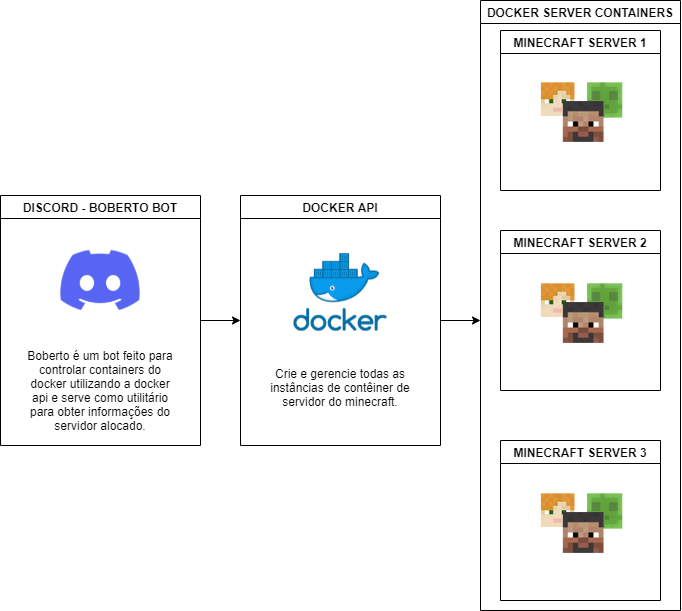

# discord-bot-vps-manager

Baseado em https://github.com/G-Bolmida/system-monitor-bot e adaptado para o meu uso
Fluxograma baseado em https://github.com/brutalzinn/minecraft-server-dockermanager

Fluxograma em construção

